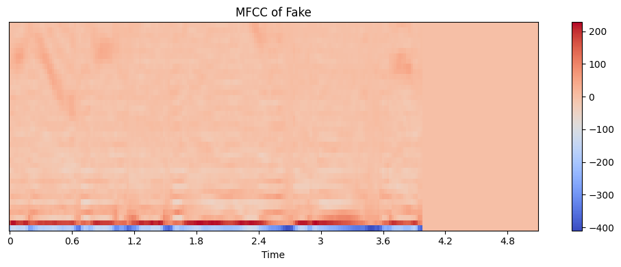

# FOR (Fake Or Real) Dataset Classification

Import Library


```python
import os
import librosa
import numpy as np
import tensorflow as tf
import keras
from keras.models import Sequential
from keras.layers import Conv2D, MaxPooling2D, Flatten, Dense, Dropout, GlobalAveragePooling2D
import plotly
import plotly.graph_objs as go
import matplotlib.pyplot as plt
```

Define a function to load audio files and extract MFCC features


```python
def load_audio_files(path):
    audio_files = []
    labels = []
    if 'fake' in path:
        label = [1.0, 0.0]
    else:
        label = [0.0, 1.0]
    for filename in os.listdir(path):
        file_path = os.path.join(path, filename)
        audio, sr = librosa.load(file_path, sr=44100)
        mfccs = librosa.feature.mfcc(y=audio, sr=sr, n_mfcc=40)
        pad_width = 220 - mfccs.shape[1]
        mfccs = np.pad(mfccs, pad_width = ((0, 0), (0, pad_width)), mode = 'constant')
        audio_files.append(mfccs)
        labels.append(label)
    return audio_files, labels
```

Set the path to the dataset directory


```python
dataset_path = "for-rerec"
```

Load the training set


```python
train_path = os.path.join(dataset_path, "training")
train_fake_path = os.path.join(train_path, "fake")
train_real_path = os.path.join(train_path, "real")
train_fake_files, train_fake_labels = load_audio_files(train_fake_path)
train_real_files, train_real_labels = load_audio_files(train_real_path)
```

Load the validation set


```python
val_path = os.path.join(dataset_path, "validation")
val_fake_path = os.path.join(val_path, "fake")
val_real_path = os.path.join(val_path, "real")
val_fake_files, val_fake_labels = load_audio_files(val_fake_path)
val_real_files, val_real_labels = load_audio_files(val_real_path)
```

Load the testing set


```python
test_path = os.path.join(dataset_path, "testing")
test_fake_path = os.path.join(test_path, "fake")
test_real_path = os.path.join(test_path, "real")
test_fake_files, test_fake_labels = load_audio_files(test_fake_path)
test_real_files, test_real_labels = load_audio_files(test_real_path)
```


```python
plt.figure(figsize=(10, 4))
librosa.display.specshow(train_fake_files[0], x_axis='time')
plt.colorbar()
plt.title('MFCC of Fake')
plt.tight_layout()
plt.show()
```


    

    


```python
plt.figure(figsize=(10, 4))
librosa.display.specshow(train_real_files[0], x_axis='time')
plt.colorbar()
plt.title('MFCC of Real')
plt.tight_layout()
plt.show()
```


    

    


Combine fake and real sets to the train, test and validation sets


```python
def combinedata(realfile, fakefile, reallabel, fakelabel):
    X = []
    Y = []
    for elem in realfile:
        X.append(elem)
    for elem in fakefile:
        X.append(elem)
    for elem in reallabel:
        Y.append(elem)
    for elem in fakelabel:
        Y.append(elem)
    return X, Y
```


```python
X_train, Y_train = combinedata(train_real_files, train_fake_files, train_real_labels, train_fake_labels)
```


```python
X_val, Y_val = combinedata(val_real_files, val_fake_files, val_real_labels, val_fake_labels)
```


```python
X_test, Y_test = combinedata(test_real_files, test_fake_files, test_real_labels, test_fake_labels)
```


```python
len(X_train), len(Y_train), len(X_val), len(Y_val), len(X_test), len(Y_test)
```


    (10208, 10208, 2244, 2244, 816, 816)


Add Channel dimension for CNN


```python
X_train = np.array(X_train, dtype='object')
X_train = np.reshape(X_train, (*X_train.shape, 1))
X_val = np.array(X_val, dtype='object')
X_val = np.reshape(X_val, (*X_val.shape, 1))
X_test = np.array(X_test, dtype='object')
X_test = np.reshape(X_test, (*X_test.shape, 1))
```


```python
Y_train = np.array(Y_train, dtype='object')
Y_val = np.array(Y_val, dtype='object')
Y_test = np.array(Y_test, dtype='object')
```

Define the model


```python
X_train.shape, X_val.shape, Y_train.shape, Y_val.shape
```


    ((10208, 40, 220, 1), (2244, 40, 220, 1), (10208, 2), (2244, 2))


```python
input_shape = (40, 220, 1)
```


```python
model = Sequential()
model.add(Conv2D(32, kernel_size=(3, 3), activation='relu', input_shape=input_shape))
model.add(MaxPooling2D(pool_size=(2, 2)))
model.add(Conv2D(64, kernel_size=(3, 3), activation='relu'))
model.add(MaxPooling2D(pool_size=(2, 2)))
model.add(Flatten())
model.add(Dense(128, activation='relu'))
model.add(Dense(2, activation='softmax'))
```

Compile the model


```python
model.compile(optimizer='adam', loss='categorical_crossentropy', metrics=['accuracy'])
```


```python
model.summary()
```

    Model: "sequential"
    _________________________________________________________________
     Layer (type)                Output Shape              Param #   
    =================================================================
     conv2d (Conv2D)             (None, 38, 218, 32)       320       
                                                                     
     max_pooling2d (MaxPooling2D  (None, 19, 109, 32)      0         
     )                                                               
                                                                     
     conv2d_1 (Conv2D)           (None, 17, 107, 64)       18496     
                                                                     
     max_pooling2d_1 (MaxPooling  (None, 8, 53, 64)        0         
     2D)                                                             
                                                                     
     flatten (Flatten)           (None, 27136)             0         
                                                                     
     dense (Dense)               (None, 128)               3473536   
                                                                     
     dense_1 (Dense)             (None, 2)                 258       
                                                                     
    =================================================================
    Total params: 3,492,610
    Trainable params: 3,492,610
    Non-trainable params: 0
    _________________________________________________________________
    

Train the model

Fit the model with the updated data


```python
X_train = tf.convert_to_tensor(X_train, dtype=tf.float32)
Y_train = tf.convert_to_tensor(Y_train, dtype=tf.float32)
X_val = tf.convert_to_tensor(X_val, dtype=tf.float32)
Y_val = tf.convert_to_tensor(Y_val, dtype=tf.float32)
X_test = tf.convert_to_tensor(X_test, dtype=tf.float32)
Y_test = tf.convert_to_tensor(Y_test, dtype=tf.float32)
```


```python
history = model.fit(X_train, Y_train, epochs=50, batch_size=32, validation_data=(X_val, Y_val))
```

    Epoch 1/50
    319/319 [==============================] - 407s 1s/step - loss: 1.2411 - accuracy: 0.8035 - val_loss: 0.1989 - val_accuracy: 0.9242
    Epoch 2/50
    319/319 [==============================] - 404s 1s/step - loss: 0.1867 - accuracy: 0.9285 - val_loss: 0.2100 - val_accuracy: 0.9184
    Epoch 3/50
    319/319 [==============================] - 401s 1s/step - loss: 0.1404 - accuracy: 0.9455 - val_loss: 0.2250 - val_accuracy: 0.9158
    Epoch 4/50
    319/319 [==============================] - 402s 1s/step - loss: 0.0977 - accuracy: 0.9629 - val_loss: 0.1403 - val_accuracy: 0.9541
    Epoch 5/50
    319/319 [==============================] - 400s 1s/step - loss: 0.0606 - accuracy: 0.9781 - val_loss: 0.2057 - val_accuracy: 0.9407
    Epoch 6/50
    319/319 [==============================] - 399s 1s/step - loss: 0.0459 - accuracy: 0.9840 - val_loss: 0.1490 - val_accuracy: 0.9563
    Epoch 7/50
    319/319 [==============================] - 400s 1s/step - loss: 0.0304 - accuracy: 0.9888 - val_loss: 0.1487 - val_accuracy: 0.9608
    Epoch 8/50
    319/319 [==============================] - 401s 1s/step - loss: 0.0319 - accuracy: 0.9892 - val_loss: 0.2190 - val_accuracy: 0.9447
    Epoch 9/50
    319/319 [==============================] - 397s 1s/step - loss: 0.0417 - accuracy: 0.9848 - val_loss: 0.2294 - val_accuracy: 0.9479
    Epoch 10/50
    319/319 [==============================] - 399s 1s/step - loss: 0.0282 - accuracy: 0.9901 - val_loss: 0.2288 - val_accuracy: 0.9363
    Epoch 11/50
    319/319 [==============================] - 402s 1s/step - loss: 0.0392 - accuracy: 0.9880 - val_loss: 0.1572 - val_accuracy: 0.9572
    Epoch 12/50
    319/319 [==============================] - 401s 1s/step - loss: 0.0216 - accuracy: 0.9949 - val_loss: 0.1942 - val_accuracy: 0.9621
    Epoch 13/50
    319/319 [==============================] - 401s 1s/step - loss: 0.0108 - accuracy: 0.9967 - val_loss: 0.1931 - val_accuracy: 0.9554
    Epoch 14/50
    319/319 [==============================] - 401s 1s/step - loss: 0.0073 - accuracy: 0.9975 - val_loss: 0.1897 - val_accuracy: 0.9572
    Epoch 15/50
    319/319 [==============================] - 401s 1s/step - loss: 0.0240 - accuracy: 0.9912 - val_loss: 0.1836 - val_accuracy: 0.9563
    Epoch 16/50
    319/319 [==============================] - 401s 1s/step - loss: 0.0246 - accuracy: 0.9923 - val_loss: 0.1701 - val_accuracy: 0.9563
    Epoch 17/50
    319/319 [==============================] - 403s 1s/step - loss: 0.0039 - accuracy: 0.9986 - val_loss: 0.2915 - val_accuracy: 0.9425
    Epoch 18/50
    319/319 [==============================] - 405s 1s/step - loss: 0.0014 - accuracy: 0.9996 - val_loss: 0.1755 - val_accuracy: 0.9652
    Epoch 19/50
    319/319 [==============================] - 400s 1s/step - loss: 0.0080 - accuracy: 0.9972 - val_loss: 0.2508 - val_accuracy: 0.9505
    Epoch 20/50
    319/319 [==============================] - 398s 1s/step - loss: 0.0411 - accuracy: 0.9889 - val_loss: 0.3816 - val_accuracy: 0.9256
    Epoch 21/50
    319/319 [==============================] - 399s 1s/step - loss: 0.0178 - accuracy: 0.9949 - val_loss: 0.1727 - val_accuracy: 0.9639
    Epoch 22/50
    319/319 [==============================] - 399s 1s/step - loss: 0.0032 - accuracy: 0.9993 - val_loss: 0.2223 - val_accuracy: 0.9608
    Epoch 23/50
    319/319 [==============================] - 399s 1s/step - loss: 0.0280 - accuracy: 0.9919 - val_loss: 0.2247 - val_accuracy: 0.9528
    Epoch 24/50
    319/319 [==============================] - 396s 1s/step - loss: 0.0088 - accuracy: 0.9964 - val_loss: 0.1616 - val_accuracy: 0.9675
    Epoch 25/50
    319/319 [==============================] - 396s 1s/step - loss: 0.0145 - accuracy: 0.9961 - val_loss: 0.2129 - val_accuracy: 0.9541
    Epoch 26/50
    319/319 [==============================] - 400s 1s/step - loss: 0.0170 - accuracy: 0.9951 - val_loss: 0.1507 - val_accuracy: 0.9652
    Epoch 27/50
    319/319 [==============================] - 400s 1s/step - loss: 2.9465e-04 - accuracy: 1.0000 - val_loss: 0.1462 - val_accuracy: 0.9684
    Epoch 28/50
    319/319 [==============================] - 399s 1s/step - loss: 6.3965e-05 - accuracy: 1.0000 - val_loss: 0.1477 - val_accuracy: 0.9688
    Epoch 29/50
    319/319 [==============================] - 399s 1s/step - loss: 4.0391e-05 - accuracy: 1.0000 - val_loss: 0.1495 - val_accuracy: 0.9679
    Epoch 30/50
    319/319 [==============================] - 399s 1s/step - loss: 2.9816e-05 - accuracy: 1.0000 - val_loss: 0.1510 - val_accuracy: 0.9697
    Epoch 31/50
    319/319 [==============================] - 398s 1s/step - loss: 2.3063e-05 - accuracy: 1.0000 - val_loss: 0.1528 - val_accuracy: 0.9701
    Epoch 32/50
    319/319 [==============================] - 398s 1s/step - loss: 1.8126e-05 - accuracy: 1.0000 - val_loss: 0.1546 - val_accuracy: 0.9706
    Epoch 33/50
    319/319 [==============================] - 399s 1s/step - loss: 1.4802e-05 - accuracy: 1.0000 - val_loss: 0.1567 - val_accuracy: 0.9710
    Epoch 34/50
    319/319 [==============================] - 400s 1s/step - loss: 1.2039e-05 - accuracy: 1.0000 - val_loss: 0.1583 - val_accuracy: 0.9710
    Epoch 35/50
    319/319 [==============================] - 401s 1s/step - loss: 9.9370e-06 - accuracy: 1.0000 - val_loss: 0.1605 - val_accuracy: 0.9719
    Epoch 36/50
    319/319 [==============================] - 403s 1s/step - loss: 8.2508e-06 - accuracy: 1.0000 - val_loss: 0.1623 - val_accuracy: 0.9724
    Epoch 37/50
    319/319 [==============================] - 404s 1s/step - loss: 6.7973e-06 - accuracy: 1.0000 - val_loss: 0.1644 - val_accuracy: 0.9733
    Epoch 38/50
    319/319 [==============================] - 402s 1s/step - loss: 5.6503e-06 - accuracy: 1.0000 - val_loss: 0.1664 - val_accuracy: 0.9724
    Epoch 39/50
    319/319 [==============================] - 401s 1s/step - loss: 4.6492e-06 - accuracy: 1.0000 - val_loss: 0.1685 - val_accuracy: 0.9719
    Epoch 40/50
    319/319 [==============================] - 399s 1s/step - loss: 3.8647e-06 - accuracy: 1.0000 - val_loss: 0.1710 - val_accuracy: 0.9724
    Epoch 41/50
    319/319 [==============================] - 400s 1s/step - loss: 3.1860e-06 - accuracy: 1.0000 - val_loss: 0.1732 - val_accuracy: 0.9737
    Epoch 42/50
    319/319 [==============================] - 399s 1s/step - loss: 2.6425e-06 - accuracy: 1.0000 - val_loss: 0.1752 - val_accuracy: 0.9737
    Epoch 43/50
    319/319 [==============================] - 399s 1s/step - loss: 2.1996e-06 - accuracy: 1.0000 - val_loss: 0.1776 - val_accuracy: 0.9737
    Epoch 44/50
    319/319 [==============================] - 396s 1s/step - loss: 1.8349e-06 - accuracy: 1.0000 - val_loss: 0.1798 - val_accuracy: 0.9737
    Epoch 45/50
    319/319 [==============================] - 397s 1s/step - loss: 1.5269e-06 - accuracy: 1.0000 - val_loss: 0.1819 - val_accuracy: 0.9742
    Epoch 46/50
    319/319 [==============================] - 399s 1s/step - loss: 1.2648e-06 - accuracy: 1.0000 - val_loss: 0.1838 - val_accuracy: 0.9742
    Epoch 47/50
    319/319 [==============================] - 400s 1s/step - loss: 1.0509e-06 - accuracy: 1.0000 - val_loss: 0.1857 - val_accuracy: 0.9742
    Epoch 48/50
    319/319 [==============================] - 398s 1s/step - loss: 8.8208e-07 - accuracy: 1.0000 - val_loss: 0.1877 - val_accuracy: 0.9737
    Epoch 49/50
    319/319 [==============================] - 396s 1s/step - loss: 7.4167e-07 - accuracy: 1.0000 - val_loss: 0.1898 - val_accuracy: 0.9733
    Epoch 50/50
    319/319 [==============================] - 398s 1s/step - loss: 6.2167e-07 - accuracy: 1.0000 - val_loss: 0.1917 - val_accuracy: 0.9728
    

Evaluate the model on the test set


```python
test_loss, test_acc = model.evaluate(X_test, Y_test)

print('Test accuracy:', test_acc)
```

    26/26 [==============================] - 10s 398ms/step - loss: 0.8955 - accuracy: 0.8578
    Test accuracy: 0.8578431606292725
    
